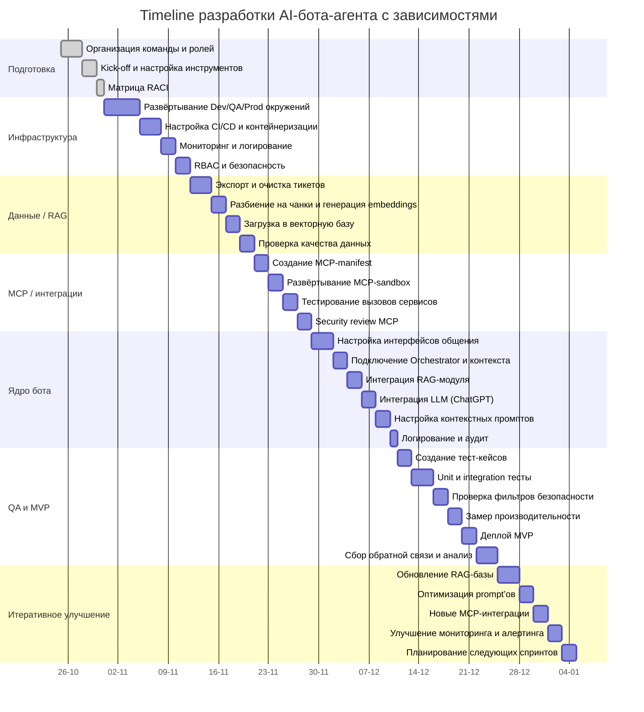

**MOC:[[MOC - Professional]]**

# Roadmap проекта

> [!tldr] ai review
> 

```mermaid
gantt
    title Timeline разработки AI-бота-агента с зависимостями
    dateFormat  YYYY-MM-DD
    axisFormat  %d-%m

    %% Цвета
    %% 💻 Разработка ядра: #00BFFF
    %% 📊 Данные / RAG: #32CD32
    %% 🔗 MCP / интеграции: #FFA500
    %% 🔒 Безопасность: #FF4500
    %% 🧪 QA / Тестирование: #9370DB
    %% 🚀 MVP / Итерации: #FFD700

    section Подготовка
    Организация команды и ролей               :done, kickoff, 2025-10-25, 3d
    Kick-off и настройка инструментов        :done, kickoff2, 2025-10-28, 2d
    Матрица RACI                             :done, raci, 2025-10-30, 1d

    section Инфраструктура
    Развёртывание Dev/QA/Prod окружений       :infra, 2025-10-31, 5d
    Настройка CI/CD и контейнеризации         :ci-cd, 2025-11-05, 3d
    Мониторинг и логирование                  :monitor, 2025-11-08, 2d
    RBAC и безопасность                       :security, 2025-11-10, 2d

    section Данные / RAG
    Экспорт и очистка тикетов                 :etl, 2025-11-12, 3d
    Разбиение на чанки и генерация embeddings :embed, 2025-11-15, 2d
    Загрузка в векторную базу                 :load, 2025-11-17, 2d
    Проверка качества данных                   :check, 2025-11-19, 2d

    section MCP / интеграции
    Создание MCP-manifest                      :mcp1, 2025-11-21, 2d
    Развёртывание MCP-sandbox                 :mcp2, 2025-11-23, 2d
    Тестирование вызовов сервисов             :mcp3, 2025-11-25, 2d
    Security review MCP                        :mcp4, 2025-11-27, 2d

    section Ядро бота
    Настройка интерфейсов общения             :bot1, 2025-11-29, 3d
    Подключение Orchestrator и контекста      :bot2, 2025-12-02, 2d
    Интеграция RAG-модуля                      :bot3, 2025-12-04, 2d
    Интеграция LLM (ChatGPT)                 :bot4, 2025-12-06, 2d
    Настройка контекстных промптов            :bot5, 2025-12-08, 2d
    Логирование и аудит                       :bot6, 2025-12-10, 1d

    section QA и MVP
    Создание тест-кейсов                       :qa1, 2025-12-11, 2d
    Unit и integration тесты                   :qa2, 2025-12-13, 3d
    Проверка фильтров безопасности             :qa3, 2025-12-16, 2d
    Замер производительности                   :qa4, 2025-12-18, 2d
    Деплой MVP                                 :deploy1, 2025-12-20, 2d
    Сбор обратной связи и анализ               :feedback, 2025-12-22, 3d

    section Итеративное улучшение
    Обновление RAG-базы                        :iter1, 2025-12-25, 3d
    Оптимизация prompt’ов                      :iter2, 2025-12-28, 2d
    Новые MCP-интеграции                        :iter3, 2025-12-30, 2d
    Улучшение мониторинга и алертинга          :iter4, 2026-01-01, 2d
    Планирование следующих спринтов             :iter5, 2026-01-03, 2d


```

### Additional materials