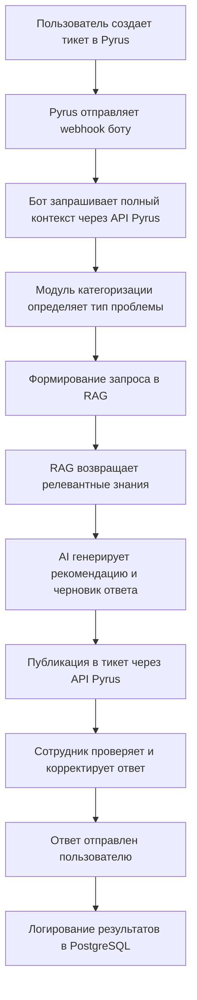
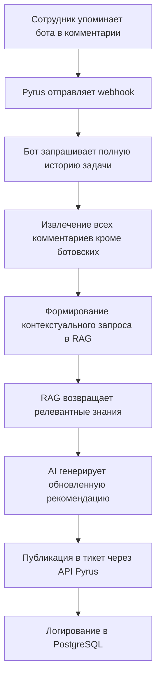
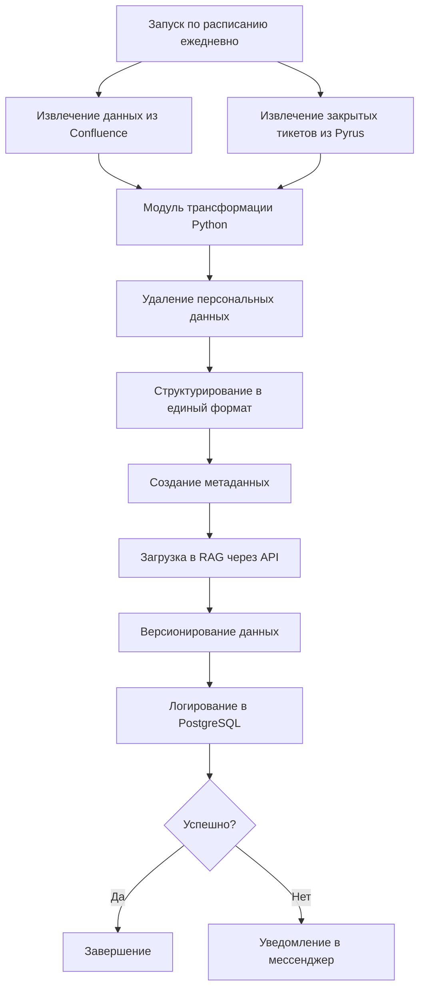
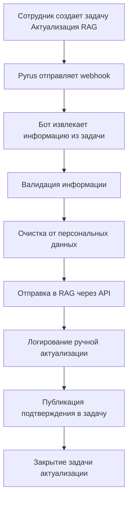
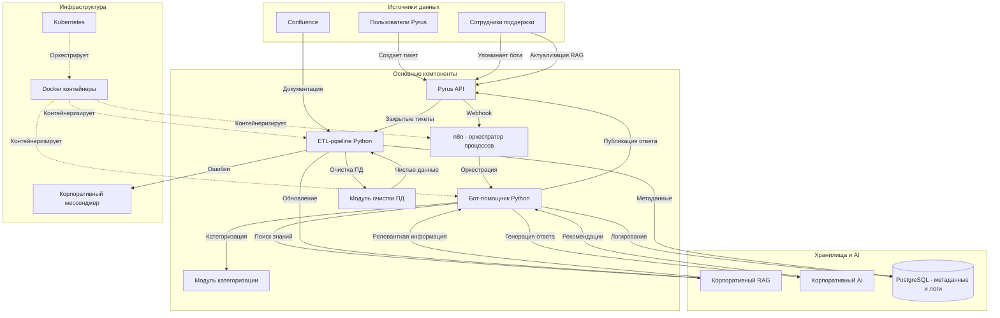

**MOC:**

# Ответ claude - первая итерация

> [!tldr] ai review
> 

## План разработки AI-помощника для технической поддержки Pyrus

Отлично, понял ваши требования. Приступаю к разработке high-level архитектурного плана для проекта AI-помощника в Pyrus.

Создам для вас комплексный план, который включит общую архитектуру системы, описание компонентов, схемы процессов и рекомендации по технологиям. Начнем с проектирования решения, а диаграммы представлю в формате Mermaid, который является универсальным и легко конвертируется в визуальные схемы.

---

## План разработки AI-помощника для технической поддержки Pyrus

## Общая архитектура решения

Предлагаемое решение состоит из трех основных подсистем, которые работают совместно для обеспечения интеллектуальной поддержки пользователей. Первая подсистема - это бот-помощник, который реагирует на события в Pyrus и предоставляет рекомендации сотрудникам поддержки. Вторая подсистема - это ETL-pipeline, который регулярно обновляет базу знаний в RAG. Третья подсистема - это механизм обратной связи, позволяющий актуализировать информацию в RAG на основе реальных кейсов.

### Компоненты системы

**Бот-помощник включает следующие модули:**

- Модуль обработки webhook от Pyrus, который получает уведомления о новых задачах и упоминаниях бота
- Модуль извлечения контекста, который собирает всю необходимую информацию из задачи и комментариев
- Модуль категоризации, который классифицирует обращения по типам проблем
- Модуль поиска в RAG, который формирует запрос и получает релевантную информацию из базы знаний
- Модуль генерации ответа с использованием корпоративного AI, который формирует рекомендации для сотрудника и черновик ответа пользователю
- Модуль публикации, который отправляет подготовленный ответ обратно в Pyrus через API

**ETL-pipeline включает следующие модули:**

- Модуль извлечения данных из источников (закрытые тикеты Pyrus с положительной обратной связью)
- Модуль трансформации, который очищает данные от персональной информации и структурирует их
- Модуль загрузки в RAG, который индексирует обработанные данные
- Модуль мониторинга и логирования для отслеживания процесса актуализации.

**Подсистема обратной связи включает:**

- Форму в Pyrus для актуализации RAG, через которую сотрудники могут добавлять новую информацию
- Обработчик запросов на обновление, который валидирует и передает информацию в RAG
- Механизм версионирования данных в RAG для возможности отката изменений

## Рекомендации по использованию технологий

Для оркестрации процессов и интеграций предлагается использовать n8n как основной инструмент. Этот low-code инструмент позволит быстро создавать и модифицировать workflow без глубокого программирования, что особенно важно для прототипирования и итеративной разработки.

Python рекомендуется использовать для создания специализированных модулей, которые требуют сложной логики. В частности, модуль очистки персональных данных, модуль категоризации тикетов и модуль формирования контекста для RAG лучше реализовать на Python как отдельные микросервисы.

Docker и Kubernetes предлагается использовать для контейнеризации и оркестрации всех компонентов системы. Это обеспечит масштабируемость, надежность и упростит развертывание в корпоративной инфраструктуре.

PostgreSQL будет служить хранилищем метаданных, логов обработки тикетов, результатов категоризации и истории обновлений RAG. База данных позволит отслеживать метрики эффективности бота и анализировать качество ответов.

Корпоративный RAG будет центральным хранилищем знаний, а корпоративный AI - генератором ответов на основе извлеченной информации из RAG.

Корпоративный мессенджер предлагается использовать для уведомлений команды поддержки о критичных ситуациях, когда бот не может найти ответ или уверенность в ответе низкая.

## Детальное описание процессов

### Процесс обработки нового тикета

Когда пользователь создает новое обращение в Pyrus, система Pyrus отправляет webhook на адрес бота-помощника. Бот получает базовую информацию о задаче, включая идентификатор тикета, и делает запрос к API Pyrus для получения полного контекста задачи - описания проблемы, приложенных файлов, заполненных полей формы.

Далее модуль категоризации анализирует содержимое обращения и присваивает ему категорию из предопределенного списка. Категории могут включать такие типы как "проблемы с интеграцией", "вопросы по функционалу", "технические сбои", "настройка маршрутизации" и другие. Эта категоризация важна для последующей оценки эффективности бота и понимания, в каких областях он работает лучше всего.

После категоризации бот формирует запрос в RAG. Запрос включает категорию проблемы, ключевые слова из описания и контекст задачи. RAG возвращает наиболее релевантные фрагменты знаний с оценкой релевантности.

Полученная информация из RAG вместе с исходным описанием проблемы передается корпоративному AI. В промпте для AI указывается задача - подготовить два текста: рекомендацию для сотрудника поддержки (что проверить, какие действия предпринять, на что обратить внимание) и черновик ответа пользователю. AI также указывает уровень уверенности в ответе.

Подготовленные рекомендация и черновик ответа публикуются в тикет как комментарий от бота через API Pyrus. Комментарий структурирован так, чтобы сотрудник поддержки мог легко отличить рекомендацию для себя от текста для пользователя.

Сотрудник поддержки изучает рекомендации бота, проверяет корректность предложенного ответа и либо подтверждает его, отправив пользователю, либо корректирует и дополняет перед отправкой. Если ответ бота был некорректен, сотрудник может создать задачу на актуализацию RAG.

Все действия логируются в PostgreSQL: время обращения, категория, найденная информация в RAG, уровень уверенности AI, факт использования ответа бота сотрудником (полностью, частично, не использован).

### Процесс прямого упоминания бота в комментарии

Когда сотрудник поддержки упоминает бота в комментарии к уже существующей задаче, Pyrus отправляет webhook о новом комментарии. Бот распознает упоминание и запускает процесс повторного анализа.

Через API Pyrus бот получает полную историю задачи: исходное описание, все комментарии (исключая комментарии от других ботов), текущий статус, изменения в полях формы. Это важно, потому что в процессе обсуждения могли появиться дополнительные детали проблемы или уточнения от пользователя.

С учетом всей накопленной информации бот снова обращается к RAG, но теперь запрос более контекстуализирован - включает не только исходную проблему, но и всю историю диалога. RAG может найти другую, более релевантную информацию, учитывая дополнительный контекст.

Процесс генерации ответа с помощью AI и публикации в тикет аналогичен процессу обработки нового тикета. Бот снова предоставляет рекомендации и черновик ответа, учитывая всю историю обсуждения.

### Процесс ежедневного обновления RAG

ETL-pipeline запускается по расписанию один раз в сутки, предпочтительно в ночное время, когда нагрузка на систему минимальна. Процесс начинается с извлечения данных из источников знаний.

Из Confluence извлекаются страницы из определенных пространств, которые содержат документацию по Pyrus, инструкции, FAQ, известные проблемы и их решения. Используется API Confluence для получения содержимого страниц и их метаданных (дата последнего обновления, автор, теги).

Из Pyrus извлекаются закрытые тикеты за последний период (например, за последние семь дней), которые были успешно решены и утверждены пользователями. Это реальные кейсы, которые показывают, какие проблемы возникают и как они решаются. Выборка осуществляется через API Pyrus с фильтрацией по статусу, дате закрытия и наличию положительной обратной связи.

Все извлеченные данные проходят через модуль трансформации на Python. Этот модуль выполняет несколько критичных функций. Во-первых, он удаляет персональные данные - имена пользователей, email-адреса, телефоны, названия конкретных компаний (заменяя их на обобщенные токены типа "клиент", "компания"). Во-вторых, он структурирует информацию в единый формат для загрузки в RAG. В-третьих, он создает метаданные для каждого фрагмента знаний - источник, дата, категория, ключевые слова.

Для обнаружения персональных данных используется комбинация подходов: регулярные выражения для email и телефонов, списки имен для деидентификации имен, NER-модели для обнаружения названий организаций. Все замены логируются для возможности аудита процесса очистки.

Очищенные и структурированные данные загружаются в RAG через API. Система версионирования позволяет откатиться к предыдущей версии базы знаний, если обновление привело к проблемам. После успешной загрузки старые версии данных помечаются как архивные, но не удаляются полностью.

Весь процесс ETL логируется в PostgreSQL: количество обработанных документов из каждого источника, количество найденных и замененных персональных данных, количество новых записей в RAG, время выполнения каждого этапа. В случае ошибок отправляются уведомления в корпоративный мессенджер команде поддержки.

### Процесс актуализации RAG по запросу

Когда сотрудник поддержки обнаруживает, что ответ бота был некорректен или неполон, он может инициировать процесс обновления знаний. Для этого создается специальная задача в Pyrus по форме "Актуализация RAG".

В форме сотрудник указывает, какая информация должна быть добавлена в базу знаний или обновлена. Он также может ссылаться на исходный тикет, где возникла проблема, что помогает связать новые знания с конкретным кейсом.

Бот-помощник получает webhook о создании задачи актуализации и извлекает предоставленную информацию. Перед добавлением в RAG информация проходит валидацию и очистку от персональных данных аналогично процессу ETL.

Очищенная информация отправляется в RAG через API с метаданными, указывающими, что это ручное обновление от сотрудника поддержки. Такие записи могут иметь более высокий приоритет при поиске, так как они основаны на реальных кейсах и проверены специалистами.

После успешного добавления в RAG бот публикует подтверждение в задачу актуализации, и задача закрывается. Все ручные актуализации логируются отдельно для анализа - какие типы информации чаще всего требуют ручного добавления, что может указывать на пробелы в автоматическом ETL.

## Схемы процессов

### Схема обработки нового тикета

### Схема упоминания бота в комментарии

### Схема ETL-pipeline

### Схема актуализации RAG по запросу

### Общая архитектурная схема

## Категоризация тикетов

Для оценки эффективности AI-помощника предлагается следующая система категорий тикетов. Каждый тикет автоматически классифицируется при первичной обработке, что позволит в дальнейшем анализировать, в каких областях бот наиболее полезен.

**Категории по типу проблемы:**

- Интеграции - вопросы по настройке и работе интеграций с внешними системами
- Маршрутизация - вопросы по настройке правил маршрутизации задач
- Функционал платформы - вопросы по использованию возможностей Pyrus
- Технические сбои - ошибки в работе платформы
- Права доступа - вопросы по управлению пользователями и правами
- Отчетность - вопросы по построению отчетов и аналитике
- Прочее - вопросы, не попадающие в другие категории

**Категории по уровню сложности (определяется ретроспективно):**

- Простые - бот предоставил корректный ответ, сотрудник использовал его без изменений
- Средние - бот предоставил частично корректный ответ, потребовались небольшие корректировки
- Сложные - бот не смог предоставить корректный ответ, сотрудник подготовил ответ самостоятельно

**Метрики для оценки эффективности:**

- Процент тикетов, где ответ бота был использован полностью
- Процент тикетов, где ответ бота был использован частично
- Среднее время ответа пользователю до и после внедрения бота
- Распределение категорий тикетов по уровню сложности
- Количество ручных актуализаций RAG по категориям

## Механизм обеспечения качества

Для поддержания высокого качества ответов бота необходима система контроля и непрерывного улучшения. Каждый ответ бота оценивается по нескольким параметрам: релевантность найденной информации из RAG, уверенность AI-модели в сгенерированном ответе, факт использования ответа сотрудником поддержки.

Если уверенность AI-модели в ответе ниже определенного порога (например, 70 процентов), бот может явно указать это в своем комментарии, предупреждая сотрудника о необходимости особенно тщательной проверки. В таких случаях также может отправляться уведомление в корпоративный мессенджер.

Когда сотрудник не использует ответ бота или значительно корректирует его, это сигнализирует о пробеле в базе знаний. Система должна облегчать процесс актуализации RAG в таких ситуациях - прямо из тикета сотрудник может инициировать добавление новой информации в базу знаний.

Еженедельный автоматический отчет позволит команде отслеживать ключевые метрики: общее количество обработанных тикетов, процент успешных ответов по категориям, топ вопросов, где бот испытывает трудности, динамику улучшения качества ответов. Этот отчет может генерироваться как задача в Pyrus или отправляться в корпоративный мессенджер.

## Рекомендации по реализации

Начать разработку предлагается с минимально жизнеспособного продукта, который включает базовый функционал обработки новых тикетов и простой ETL из одного источника (например, только Confluence). Это позволит быстро проверить гипотезу и получить обратную связь от команды поддержки.

На первом этапе можно реализовать бота-помощника в n8n, используя готовые интеграции с Pyrus, RAG и AI. Это даст возможность быстро создать рабочий прототип и начать сбор метрик эффективности. Логику категоризации можно реализовать простым правилами на основе ключевых слов.

На втором этапе стоит добавить модуль очистки персональных данных на Python и расширить ETL, включив закрытые тикеты Pyrus как источник знаний. Также на этом этапе можно реализовать функционал упоминания бота в комментариях и ручной актуализации RAG.

На третьем этапе рекомендуется контейнеризировать все компоненты в Docker и развернуть в Kubernetes для обеспечения надежности и масштабируемости. Также стоит внедрить полноценную систему мониторинга и алертинга через корпоративный мессенджер.

Критически важно на всех этапах собирать обратную связь от сотрудников поддержки и итеративно улучшать систему на основе реальных кейсов использования. База знаний будет качественно расти только при активном участии команды в процессе актуализации.

---

Этот план дает high-level представление о решении и может быть детализирован на этапе технического проектирования. Какие аспекты плана вы хотели бы уточнить или углубить?

### Additional materials