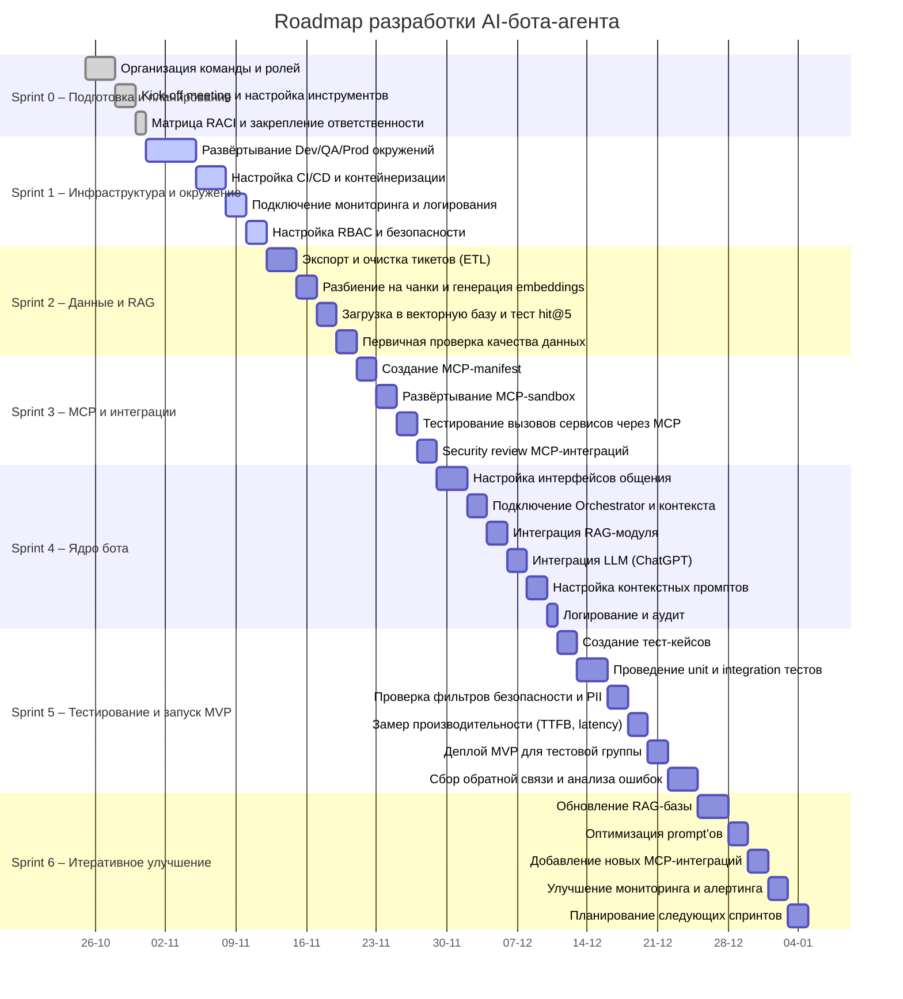

**MOC:[[MOC - Professional]]**

# Roadmap проекта

> [!tldr] ai review
> 

```mermaid
gantt
    title Roadmap разработки AI-бота-агента
    dateFormat  YYYY-MM-DD
    axisFormat  %d-%m
    section Sprint 0 – Подготовка и планирование
    Организация команды и ролей            :done,     kickoff, 2025-10-25, 3d
    Kick-off meeting и настройка инструментов :done, kickoff2, 2025-10-28, 2d
    Матрица RACI и закрепление ответственности :done, raci, 2025-10-30, 1d

    section Sprint 1 – Инфраструктура и окружение
    Развёртывание Dev/QA/Prod окружений     :active, infra, 2025-10-31, 5d
    Настройка CI/CD и контейнеризации        :active, ci_cd, 2025-11-05, 3d
    Подключение мониторинга и логирования   :active, monitor, 2025-11-08, 2d
    Настройка RBAC и безопасности           :active, security, 2025-11-10, 2d

    section Sprint 2 – Данные и RAG
    Экспорт и очистка тикетов (ETL)        :rag1, 2025-11-12, 3d
    Разбиение на чанки и генерация embeddings :rag2, 2025-11-15, 2d
    Загрузка в векторную базу и тест hit@5 :rag3, 2025-11-17, 2d
    Первичная проверка качества данных       :rag4, 2025-11-19, 2d

    section Sprint 3 – MCP и интеграции
    Создание MCP-manifest                    :mcp1, 2025-11-21, 2d
    Развёртывание MCP-sandbox               :mcp2, 2025-11-23, 2d
    Тестирование вызовов сервисов через MCP :mcp3, 2025-11-25, 2d
    Security review MCP-интеграций          :mcp4, 2025-11-27, 2d

    section Sprint 4 – Ядро бота
    Настройка интерфейсов общения           :bot1, 2025-11-29, 3d
    Подключение Orchestrator и контекста    :bot2, 2025-12-02, 2d
    Интеграция RAG-модуля                    :bot3, 2025-12-04, 2d
    Интеграция LLM (ChatGPT)               :bot4, 2025-12-06, 2d
    Настройка контекстных промптов          :bot5, 2025-12-08, 2d
    Логирование и аудит                     :bot6, 2025-12-10, 1d

    section Sprint 5 – Тестирование и запуск MVP
    Создание тест-кейсов                     :qa1, 2025-12-11, 2d
    Проведение unit и integration тестов    :qa2, 2025-12-13, 3d
    Проверка фильтров безопасности и PII    :qa3, 2025-12-16, 2d
    Замер производительности (TTFB, latency) :qa4, 2025-12-18, 2d
    Деплой MVP для тестовой группы          :deploy1, 2025-12-20, 2d
    Сбор обратной связи и анализа ошибок     :feedback, 2025-12-22, 3d

    section Sprint 6 – Итеративное улучшение
    Обновление RAG-базы                      :iter1, 2025-12-25, 3d
    Оптимизация prompt’ов                    :iter2, 2025-12-28, 2d
    Добавление новых MCP-интеграций         :iter3, 2025-12-30, 2d
    Улучшение мониторинга и алертинга       :iter4, 2026-01-01, 2d
    Планирование следующих спринтов          :iter5, 2026-01-03, 2d

```

### Additional materials