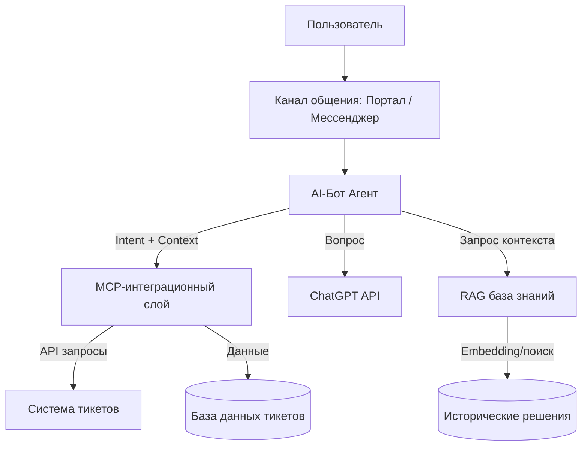

**MOC:[[MOC - Professional]]**

# Техническое задание и план разработки AI бота-агента

> [!tldr] ai review
> 

## **1. Инициация проекта**

### **1.1 Цель проекта**

Создать интеллектуального бота-агента, который:

- Консультирует пользователей по вопросам работы с системой электронного документооборота (ЭДО);
- Использует **большую языковую модель (ChatGPT)** для естественного диалога;
- Работает с **базой знаний на основе прошлых тикетов** (RAG — Retrieval-Augmented Generation);
- Поддерживает **интеграцию через MCP (Model Context Protocol)** для подключения к внешним сервисам;
- Встраивается в текущую инфраструктуру службы сопровождения (например, HelpDesk, портал, мессенджер и др.).

### **1.2 Основные заинтересованные стороны (stakeholders)**

|Роль|Ответственность|
|---|---|
|Руководитель группы сопровождения|Инициатор проекта, Product Owner|
|Архитектор системы|Проектирование архитектуры, определение интеграций|
|Разработчики|Реализация бота и интеграций|
|Data Engineer|Формирование и поддержка базы знаний (RAG)|
|DevOps|CI/CD, инфраструктура, развертывание|
|QA-инженер|Тестирование и контроль качества|
|Пользователи|Конечные потребители сервиса|

### **1.3 Ключевые цели**

- Сократить нагрузку на службу поддержки (L1/L2);
- Повысить скорость и качество ответов пользователям;
- Систематизировать накопленные знания из прошлых тикетов;
- Создать масштабируемое решение для последующего использования в других подразделениях.

### **1.4 Ожидаемые результаты**

- Рабочий бот-агент, способный консультировать пользователей 24/7;
- RAG-база знаний, автоматически пополняемая на основе тикетов;
- Настроенные интеграции с MCP, HelpDesk API, БД и LLM;
- Метрики производительности и удовлетворённости пользователей (CSAT, SLA).

---

## **2. Бизнес-требования**

### **2.1 Основные сценарии использования**

|№|Сценарий|Описание|
|---|---|---|
|1|Пользователь задает вопрос|Бот определяет контекст, обращается к базе знаний (RAG) и LLM, возвращает ответ|
|2|Обращение по существующему тикету|Бот извлекает данные из тикета и предоставляет обновления|
|3|Создание нового запроса|Бот формирует тикет через API HelpDesk|
|4|Эскалация|Если вопрос не решён — передаёт обращение оператору|
|5|Обучение и саморазвитие|Бот анализирует новые тикеты для обновления базы знаний|

### **2.2 Ограничения**

- Доступ к корпоративным данным регулируется политикой безопасности;
- Работа только внутри защищенного корпоративного периметра;
- Возможность офлайн-обновления RAG (без постоянного интернета);
- Использование одобренной LLM (ChatGPT API, локальная модель, или on-premise-версия).

### **2.3 Ключевые метрики успеха**

|Метрика|Целевое значение|
|---|---|
|% решённых вопросов без участия оператора|≥ 60%|
|Среднее время ответа|≤ 5 секунд|
|Уровень удовлетворенности (CSAT)|≥ 85%|
|Снижение нагрузки на операторов|≥ 30%|

---

## **3. Функциональные требования**

### **3.1 Основные функции**

1. **Обработка запросов** — понимание естественного языка, определение намерений (Intent Detection).
2. **RAG-запросы** — поиск релевантных решений из базы знаний по прошлым тикетам.
3. **Интеграция через MCP** — безопасное взаимодействие с внешними сервисами (например, тикет-система, база знаний, портал).
4. **Ответы на вопросы** — генерация ответов на естественном языке через ChatGPT.
5. **Контекстная поддержка** — сохранение контекста диалога.
6. **Обучение** — автоматическое обновление базы знаний.
7. **Аналитика** — сбор статистики по обращениям, SLA, CSAT.

### **3.2 Нефункциональные требования**

|Категория|Требование|
|---|---|
|Производительность|Обработка запроса ≤ 5 сек|
|Масштабируемость|Поддержка 1000 одновременных обращений|
|Надёжность|99.5% uptime|
|Безопасность|Шифрование, логирование, контроль доступа|
|Поддерживаемость|Документация, CI/CD, мониторинг|

### **3.3 Интеграции**

|Система|Назначение|Технология|
|---|---|---|
|HelpDesk (Pyrus, JIRA, ServiceNow и т.д.)|Получение тикетов, создание обращений|API / MCP|
|ChatGPT|Генерация ответов|API|
|База знаний (RAG)|Поиск релевантных решений|ElasticSearch / FAISS / Chroma|
|Внутренний портал / мессенджер|Канал общения с пользователем|API / Webhook / MCP Adapter|

---

## **4. Архитектура решения (высокоуровневая)**

### **4.1 Общая схема**

### **4.2 Компоненты**

|Компонент|Описание|Технологии|
|---|---|---|
|**Интерфейс общения**|Веб-чат, VK Teams, Telegram, MS Teams и др.|HTML/JS, Bot API|
|**Ядро бота (Bot Core)**|Управление диалогом, маршрутизация, вызовы MCP и LLM|Python + FastAPI|
|**RAG-модуль**|Векторизация, поиск, обновление контента|LangChain / LlamaIndex|
|**Интеграционный слой MCP**|Контекстная интеграция с внешними системами|MCP SDK|
|**LLM слой**|Вызов ChatGPT или локальной LLM|OpenAI API / Azure OpenAI / Ollama|
|**Мониторинг и логирование**|Метрики, SLA, алерты|Prometheus, Grafana, ELK|

### **4.3 Поток данных (Data Flow)**

1. Пользователь отправляет запрос;
2. Бот анализирует текст и извлекает Intent;
3. Формирует контекстный запрос к RAG;
4. RAG возвращает релевантные фрагменты;
5. ChatGPT формирует ответ, используя retrieved context;
6. Ответ отправляется пользователю;
7. Сессия логируется для последующего анализа и обучения.

### Additional materials