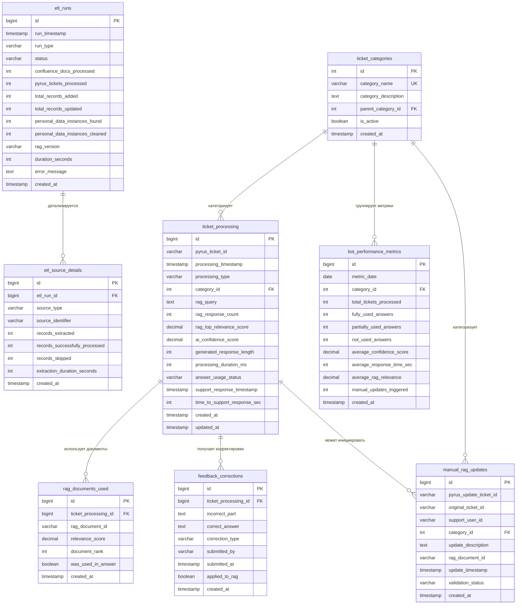

**MOC:**

# PostgreSQL будет служить хранилищем метаданных, логов обработки тикетов, результатов категоризации и истории обновлений RAG

> [!tldr] ai review
> 

Отличный вопрос! Позвольте мне подробно разъяснить, что именно будет храниться в PostgreSQL как метаданные в контексте этой системы.

Под метаданными в данном случае понимается информация **о данных и процессах**, но не сами данные. Это как каталожные карточки в библиотеке - они не содержат книги, но рассказывают о книгах: когда поступила, кто брал, где находится.

В контексте вашей системы AI-помощника PostgreSQL будет хранить несколько типов метаданных, каждый из которых решает свою задачу.

**Метаданные о тикетах** включают информацию о каждом обращении, которое обработал бот. Это идентификатор тикета в Pyrus, временная метка когда тикет был создан и когда бот его обработал, присвоенная категория проблемы, какой запрос был сформирован для RAG, сколько релевантных документов вернул RAG и с какими оценками релевантности. Важно понимать, что в PostgreSQL не будет храниться само содержимое тикета или персональные данные пользователей - только ссылки и технические характеристики обработки.

**Метаданные о работе бота** фиксируют результаты каждого обращения к AI-системе. Здесь сохраняется уровень уверенности AI-модели в сгенерированном ответе, длина сгенерированного ответа, время обработки запроса, какие фрагменты из RAG были использованы для генерации (ссылки на них, но не сам текст). Эта информация критична для понимания, насколько хорошо работает бот в разных ситуациях.

**Метаданные об использовании ответов** показывают, как сотрудники поддержки взаимодействуют с рекомендациями бота. Система фиксирует, был ли ответ бота использован полностью, частично изменен или полностью переписан сотрудником. Также сохраняется время между получением ответа бота и отправкой финального ответа пользователю, что помогает оценить, сколько времени сотрудник потратил на проверку и корректировку. Если сотрудник инициировал актуализацию RAG после работы с тикетом, эта связь также фиксируется.

**Метаданные об обновлениях RAG** ведут историю всех изменений в базе знаний. Для каждого запуска ETL-pipeline сохраняется временная метка, количество обработанных документов из каждого источника (Confluence, Pyrus), сколько новых записей было добавлено в RAG, сколько обновлено, версия загруженных данных. При ручной актуализации фиксируется кто инициировал обновление, из какого тикета пришел запрос, какая категория знаний была дополнена. Это позволяет отследить эволюцию базы знаний и понять, какие области требуют наибольшего внимания.

**Статистические метаданные** агрегируют информацию для анализа эффективности. Например, для каждой категории тикетов система подсчитывает процент успешных ответов бота, среднее время ответа, количество случаев, когда потребовалась ручная актуализация RAG. Эти данные позволяют увидеть общую картину - где бот справляется хорошо, а где нуждается в улучшении.

Критическое отличие метаданных от самих данных заключается в том, что метаданные не содержат конфиденциальной информации. Если в тикете пользователь написал "У меня проблема с интеграцией 1С в компании Ромашка", то в PostgreSQL сохранится примерно следующее: идентификатор тикета пять тысяч двести тридцать четыре, категория - интеграции, дата обработки, уровень уверенности бота восемьдесят пять процентов, ответ использован частично. Само содержание проблемы и название компании остаются только в Pyrus и RAG, причем в RAG после очистки персональных данных.

Такая архитектура хранения позволяет команде проекта анализировать эффективность системы, строить отчеты и дашборды, находить паттерны в работе бота, при этом не создавая дополнительных рисков для конфиденциальности данных. PostgreSQL становится аналитическим слоем системы, который отвечает на вопросы "как работает бот" и "насколько он полезен", но не хранит чувствительную информацию о конкретных проблемах пользователей.

Это понятнее теперь? Есть ли другие аспекты архитектуры, которые требуют уточнения?


Отлично, давайте спроектируем структуру базы данных PostgreSQL, которая будет поддерживать все необходимые метаданные для системы AI-помощника. Я постараюсь объяснить не только что хранить, но и почему именно так организована структура.

Начну с того, что в центре нашей модели данных находится обработка тикетов ботом. Вокруг этого ключевого процесса выстраиваются все остальные сущности - категории, обновления RAG, история взаимодействий. Такая архитектура позволяет легко отслеживать жизненный цикл каждого обращения и строить аналитику по любым срезам.

## Основные таблицы

### Таблица ticket_processing

Это центральная таблица, которая хранит информацию о каждой обработке тикета ботом. Важно понимать, что один и тот же тикет может быть обработан несколько раз - например, при первичном создании и затем при упоминании бота в комментарии. Поэтому каждая запись в этой таблице представляет собой отдельный акт обработки, а не сам тикет.

```sql
CREATE TABLE ticket_processing (
    id BIGSERIAL PRIMARY KEY,
    pyrus_ticket_id VARCHAR(100) NOT NULL,  -- ID тикета в Pyrus
    processing_timestamp TIMESTAMP NOT NULL DEFAULT CURRENT_TIMESTAMP,
    processing_type VARCHAR(50) NOT NULL,  -- 'new_ticket' или 'bot_mention'
    category_id INTEGER REFERENCES ticket_categories(id),
    rag_query TEXT,  -- Запрос, который был отправлен в RAG
    rag_response_count INTEGER,  -- Сколько документов вернул RAG
    rag_top_relevance_score DECIMAL(5,2),  -- Наивысшая оценка релевантности из RAG
    ai_confidence_score DECIMAL(5,2),  -- Уверенность AI в ответе (0-100)
    generated_response_length INTEGER,  -- Длина сгенерированного ответа в символах
    processing_duration_ms INTEGER,  -- Время обработки в миллисекундах
    answer_usage_status VARCHAR(50),  -- 'fully_used', 'partially_used', 'not_used', 'pending'
    support_response_timestamp TIMESTAMP,  -- Когда сотрудник отправил ответ пользователю
    time_to_support_response_sec INTEGER,  -- Время от ответа бота до ответа сотрудника
    created_at TIMESTAMP DEFAULT CURRENT_TIMESTAMP,
    updated_at TIMESTAMP DEFAULT CURRENT_TIMESTAMP
);

-- Индексы для ускорения аналитических запросов
CREATE INDEX idx_ticket_processing_pyrus_id ON ticket_processing(pyrus_ticket_id);
CREATE INDEX idx_ticket_processing_timestamp ON ticket_processing(processing_timestamp);
CREATE INDEX idx_ticket_processing_category ON ticket_processing(category_id);
CREATE INDEX idx_ticket_processing_usage ON ticket_processing(answer_usage_status);
```

Поле processing_type позволяет различать первичную обработку нового тикета от повторной обработки при упоминании бота. Это важно для аналитики, потому что паттерны успешности могут отличаться - при повторном обращении у бота больше контекста.

Поле answer_usage_status имеет статус pending до тех пор, пока сотрудник не отреагирует на тикет. После этого система обновляет статус на основе анализа действий сотрудника. Полностью использованным считается ответ, который сотрудник скопировал без изменений или с минимальными правками форматирования.

### Таблица ticket_categories

Справочник категорий тикетов, который позволяет классифицировать обращения и строить аналитику по типам проблем. Эта таблица небольшая и относительно статичная, но выделение её в отдельную сущность дает гибкость для добавления новых категорий без изменения основной таблицы.

```sql
CREATE TABLE ticket_categories (
    id SERIAL PRIMARY KEY,
    category_name VARCHAR(100) NOT NULL UNIQUE,
    category_description TEXT,
    parent_category_id INTEGER REFERENCES ticket_categories(id),  -- Для иерархии категорий
    is_active BOOLEAN DEFAULT true,
    created_at TIMESTAMP DEFAULT CURRENT_TIMESTAMP
);

-- Предзаполнение основных категорий
INSERT INTO ticket_categories (category_name, category_description) VALUES
('integrations', 'Вопросы по настройке и работе интеграций с внешними системами'),
('routing', 'Вопросы по настройке правил маршрутизации задач'),
('platform_functionality', 'Вопросы по использованию возможностей Pyrus'),
('technical_issues', 'Ошибки в работе платформы'),
('access_rights', 'Вопросы по управлению пользователями и правами'),
('reporting', 'Вопросы по построению отчетов и аналитике'),
('other', 'Вопросы, не попадающие в другие категории');
```

Поле parent_category_id позволяет создавать иерархическую структуру категорий. Например, категория "интеграции" может иметь подкатегории "интеграция с 1С", "интеграция с email" и так далее. Это дает возможность детализировать аналитику по мере накопления данных.

### Таблица rag_documents_used

Эта таблица фиксирует, какие конкретные документы из RAG были использованы для генерации каждого ответа. Это критически важно для понимания качества базы знаний и отслеживания, какие документы наиболее полезны.

```sql
CREATE TABLE rag_documents_used (
    id BIGSERIAL PRIMARY KEY,
    ticket_processing_id BIGINT REFERENCES ticket_processing(id) ON DELETE CASCADE,
    rag_document_id VARCHAR(200) NOT NULL,  -- ID документа в RAG
    relevance_score DECIMAL(5,2),  -- Оценка релевантности этого документа
    document_rank INTEGER,  -- Позиция документа в результатах поиска (1, 2, 3...)
    was_used_in_answer BOOLEAN,  -- Был ли этот документ реально использован в ответе
    created_at TIMESTAMP DEFAULT CURRENT_TIMESTAMP
);

CREATE INDEX idx_rag_docs_processing_id ON rag_documents_used(ticket_processing_id);
CREATE INDEX idx_rag_docs_document_id ON rag_documents_used(rag_document_id);
```

Разделение документов, которые RAG вернул, и тех, которые AI реально использовал в ответе, помогает понять эффективность ранжирования в RAG. Если документ с высокой оценкой релевантности не используется AI, возможно, RAG неправильно оценивает релевантность или документ содержит шум.

### Таблица etl_runs

Эта таблица ведет историю запусков ETL-pipeline для обновления базы знаний. Каждый запуск - это отдельная запись, которая позволяет отследить, когда и как обновлялась база знаний.

```sql
CREATE TABLE etl_runs (
    id BIGSERIAL PRIMARY KEY,
    run_timestamp TIMESTAMP NOT NULL DEFAULT CURRENT_TIMESTAMP,
    run_type VARCHAR(50) NOT NULL,  -- 'scheduled' или 'manual'
    status VARCHAR(50) NOT NULL,  -- 'started', 'completed', 'failed'
    confluence_docs_processed INTEGER DEFAULT 0,
    pyrus_tickets_processed INTEGER DEFAULT 0,
    total_records_added INTEGER DEFAULT 0,
    total_records_updated INTEGER DEFAULT 0,
    personal_data_instances_found INTEGER DEFAULT 0,  -- Сколько вхождений ПД найдено
    personal_data_instances_cleaned INTEGER DEFAULT 0,  -- Сколько очищено
    rag_version VARCHAR(50),  -- Версия данных в RAG после этого обновления
    duration_seconds INTEGER,
    error_message TEXT,  -- Если произошла ошибка
    created_at TIMESTAMP DEFAULT CURRENT_TIMESTAMP
);

CREATE INDEX idx_etl_runs_timestamp ON etl_runs(run_timestamp);
CREATE INDEX idx_etl_runs_status ON etl_runs(status);
```

Отслеживание количества найденных и очищенных персональных данных критично для аудита безопасности. Если вдруг количество найденных ПД резко возрастает, это может сигнализировать о проблеме в процессе очистки или изменении в источниках данных.

### Таблица etl_source_details

Детализация по источникам данных для каждого запуска ETL. Эта таблица связана с etl_runs и позволяет понять, из каких конкретно источников были получены данные.

```sql
CREATE TABLE etl_source_details (
    id BIGSERIAL PRIMARY KEY,
    etl_run_id BIGINT REFERENCES etl_runs(id) ON DELETE CASCADE,
    source_type VARCHAR(50) NOT NULL,  -- 'confluence' или 'pyrus'
    source_identifier VARCHAR(200),  -- Например, space key в Confluence
    records_extracted INTEGER,
    records_successfully_processed INTEGER,
    records_skipped INTEGER,  -- Пропущено из-за ошибок или дубликатов
    extraction_duration_seconds INTEGER,
    created_at TIMESTAMP DEFAULT CURRENT_TIMESTAMP
);

CREATE INDEX idx_etl_source_run_id ON etl_source_details(etl_run_id);
```

Эта таблица помогает понять, какие источники данают наиболее ценную информацию и где могут возникать проблемы при извлечении данных.

### Таблица manual_rag_updates

Отдельная таблица для отслеживания ручных обновлений RAG, когда сотрудник поддержки инициирует добавление новых знаний через специальную форму в Pyrus.

```sql
CREATE TABLE manual_rag_updates (
    id BIGSERIAL PRIMARY KEY,
    pyrus_update_ticket_id VARCHAR(100) NOT NULL,  -- ID задачи "Актуализация RAG"
    original_ticket_id VARCHAR(100),  -- ID тикета, который вызвал необходимость обновления
    support_user_id VARCHAR(100),  -- ID сотрудника, который инициировал обновление
    category_id INTEGER REFERENCES ticket_categories(id),
    update_description TEXT,  -- Описание того, что обновляется
    rag_document_id VARCHAR(200),  -- ID созданного/обновленного документа в RAG
    update_timestamp TIMESTAMP NOT NULL DEFAULT CURRENT_TIMESTAMP,
    validation_status VARCHAR(50) DEFAULT 'pending',  -- 'pending', 'approved', 'rejected'
    created_at TIMESTAMP DEFAULT CURRENT_TIMESTAMP
);

CREATE INDEX idx_manual_updates_original_ticket ON manual_rag_updates(original_ticket_id);
CREATE INDEX idx_manual_updates_category ON manual_rag_updates(category_id);
CREATE INDEX idx_manual_updates_timestamp ON manual_rag_updates(update_timestamp);
```

Связь с original_ticket_id позволяет проследить цепочку от проблемного кейса до обновления базы знаний. Это важно для понимания, какие типы проблем чаще всего требуют ручного вмешательства.

### Таблица bot_performance_metrics

Агрегированная таблица с предрассчитанными метриками для быстрого построения дашбордов и отчетов. Эта таблица обновляется периодически (например, раз в день) и содержит агрегаты по различным срезам.

```sql
CREATE TABLE bot_performance_metrics (
    id BIGSERIAL PRIMARY KEY,
    metric_date DATE NOT NULL,
    category_id INTEGER REFERENCES ticket_categories(id),
    total_tickets_processed INTEGER DEFAULT 0,
    fully_used_answers INTEGER DEFAULT 0,
    partially_used_answers INTEGER DEFAULT 0,
    not_used_answers INTEGER DEFAULT 0,
    average_confidence_score DECIMAL(5,2),
    average_response_time_sec INTEGER,
    average_rag_relevance DECIMAL(5,2),
    manual_updates_triggered INTEGER DEFAULT 0,
    created_at TIMESTAMP DEFAULT CURRENT_TIMESTAMP,
    UNIQUE(metric_date, category_id)
);

CREATE INDEX idx_metrics_date ON bot_performance_metrics(metric_date);
CREATE INDEX idx_metrics_category ON bot_performance_metrics(category_id);
```

Эта таблица - оптимизация для аналитики. Вместо того чтобы каждый раз агрегировать данные из ticket_processing при построении отчета, система может быстро получить готовые метрики из этой таблицы.

### Таблица feedback_corrections

Эта таблица фиксирует случаи, когда сотрудник поддержки явно помечает ответ бота как некорректный и предоставляет правильный ответ. Это ценная информация для обучения и улучшения системы.

```sql
CREATE TABLE feedback_corrections (
    id BIGSERIAL PRIMARY KEY,
    ticket_processing_id BIGINT REFERENCES ticket_processing(id) ON DELETE CASCADE,
    incorrect_part TEXT,  -- Что именно было неправильно в ответе бота
    correct_answer TEXT,  -- Правильный ответ от сотрудника
    correction_type VARCHAR(50),  -- 'factual_error', 'outdated_info', 'incomplete', 'other'
    submitted_by VARCHAR(100),  -- ID сотрудника
    submitted_at TIMESTAMP DEFAULT CURRENT_TIMESTAMP,
    applied_to_rag BOOLEAN DEFAULT false,  -- Была ли эта корректировка применена к RAG
    created_at TIMESTAMP DEFAULT CURRENT_TIMESTAMP
);

CREATE INDEX idx_feedback_processing_id ON feedback_corrections(ticket_processing_id);
CREATE INDEX idx_feedback_applied ON feedback_corrections(applied_to_rag);
```

Эта таблица создает обучающий датасет для будущих улучшений. Анализируя типы ошибок и корректировки, команда может понять системные проблемы и улучшить как RAG, так и промпты для AI.

## Связи между таблицами

Теперь давайте посмотрим на общую картину связей между таблицами. Центральная таблица ticket_processing связана практически со всеми остальными таблицами, что логично - она представляет ключевой процесс системы.

```
ticket_categories (справочник)
        ↓ (many-to-one)
ticket_processing (центральная таблица)
        ↓ (one-to-many)
    ├── rag_documents_used (детали использованных документов)
    └── feedback_corrections (корректировки от сотрудников)

etl_runs (история обновлений RAG)
        ↓ (one-to-many)
etl_source_details (детали по источникам)

manual_rag_updates (ручные обновления)
        ↓ (может ссылаться на)
ticket_processing (через original_ticket_id)

bot_performance_metrics (агрегированные метрики)
        ↓ (ссылается на)
ticket_categories (для группировки)
```

## Представления для упрощения запросов

Для упрощения построения отчетов и аналитики предлагаю создать несколько представлений, которые объединяют данные из нескольких таблиц в удобном для анализа виде.

```sql
-- Представление для анализа эффективности по категориям
CREATE VIEW v_category_performance AS
SELECT 
    tc.category_name,
    DATE(tp.processing_timestamp) as processing_date,
    COUNT(*) as total_processed,
    SUM(CASE WHEN tp.answer_usage_status = 'fully_used' THEN 1 ELSE 0 END) as fully_used,
    SUM(CASE WHEN tp.answer_usage_status = 'partially_used' THEN 1 ELSE 0 END) as partially_used,
    SUM(CASE WHEN tp.answer_usage_status = 'not_used' THEN 1 ELSE 0 END) as not_used,
    AVG(tp.ai_confidence_score) as avg_confidence,
    AVG(tp.time_to_support_response_sec) as avg_response_time_sec
FROM ticket_processing tp
JOIN ticket_categories tc ON tp.category_id = tc.id
WHERE tp.answer_usage_status != 'pending'
GROUP BY tc.category_name, DATE(tp.processing_timestamp);

-- Представление для отслеживания проблемных тикетов
CREATE VIEW v_problematic_tickets AS
SELECT 
    tp.id,
    tp.pyrus_ticket_id,
    tp.processing_timestamp,
    tc.category_name,
    tp.ai_confidence_score,
    tp.answer_usage_status,
    fc.correction_type,
    mu.id as manual_update_id
FROM ticket_processing tp
JOIN ticket_categories tc ON tp.category_id = tc.id
LEFT JOIN feedback_corrections fc ON tp.id = fc.ticket_processing_id
LEFT JOIN manual_rag_updates mu ON tp.pyrus_ticket_id = mu.original_ticket_id
WHERE tp.answer_usage_status = 'not_used' 
   OR tp.ai_confidence_score < 70
   OR fc.id IS NOT NULL;

-- Представление для анализа качества RAG
CREATE VIEW v_rag_effectiveness AS
SELECT 
    tp.processing_timestamp::date as processing_date,
    tc.category_name,
    AVG(tp.rag_top_relevance_score) as avg_top_relevance,
    AVG(tp.rag_response_count) as avg_docs_returned,
    COUNT(CASE WHEN tp.answer_usage_status = 'fully_used' THEN 1 END) * 100.0 / COUNT(*) as success_rate
FROM ticket_processing tp
JOIN ticket_categories tc ON tp.category_id = tc.id
WHERE tp.answer_usage_status != 'pending'
GROUP BY tp.processing_timestamp::date, tc.category_name;
```

Эти представления инкапсулируют сложные аналитические запросы и делают их переиспользуемыми. Любой инструмент визуализации или отчетности может просто запросить данные из этих представлений вместо того, чтобы писать сложные JOIN-ы.

## Триггеры для автоматического обновления метрик

Для поддержания актуальности агрегированных метрик предлагаю использовать триггеры, которые будут автоматически обновлять таблицу bot_performance_metrics при изменении статуса обработки тикета.

```sql
-- Функция для обновления метрик при изменении статуса ответа
CREATE OR REPLACE FUNCTION update_performance_metrics()
RETURNS TRIGGER AS $$
BEGIN
    -- Обновляем метрики для конкретной даты и категории
    INSERT INTO bot_performance_metrics (
        metric_date,
        category_id,
        total_tickets_processed,
        fully_used_answers,
        partially_used_answers,
        not_used_answers
    )
    SELECT 
        DATE(NEW.processing_timestamp),
        NEW.category_id,
        1,
        CASE WHEN NEW.answer_usage_status = 'fully_used' THEN 1 ELSE 0 END,
        CASE WHEN NEW.answer_usage_status = 'partially_used' THEN 1 ELSE 0 END,
        CASE WHEN NEW.answer_usage_status = 'not_used' THEN 1 ELSE 0 END
    ON CONFLICT (metric_date, category_id) 
    DO UPDATE SET
        total_tickets_processed = bot_performance_metrics.total_tickets_processed + 1,
        fully_used_answers = bot_performance_metrics.fully_used_answers + 
            CASE WHEN NEW.answer_usage_status = 'fully_used' THEN 1 ELSE 0 END,
        partially_used_answers = bot_performance_metrics.partially_used_answers + 
            CASE WHEN NEW.answer_usage_status = 'partially_used' THEN 1 ELSE 0 END,
        not_used_answers = bot_performance_metrics.not_used_answers + 
            CASE WHEN NEW.answer_usage_status = 'not_used' THEN 1 ELSE 0 END;
    
    RETURN NEW;
END;
$$ LANGUAGE plpgsql;

-- Триггер, который вызывается при обновлении статуса
CREATE TRIGGER trg_update_metrics
AFTER UPDATE OF answer_usage_status ON ticket_processing
FOR EACH ROW
WHEN (OLD.answer_usage_status = 'pending' AND NEW.answer_usage_status != 'pending')
EXECUTE FUNCTION update_performance_metrics();
```

Этот триггер автоматически обновляет агрегированные метрики в реальном времени, как только сотрудник поддержки завершает работу с тикетом и система фиксирует, как был использован ответ бота.

## Итоговая схема в виде диаграммы



Эта структура базы данных обеспечивает полную прослеживаемость работы системы от момента поступления тикета до анализа эффективности и непрерывного улучшения базы знаний. Каждая таблица имеет четкую ответственность, и связи между ними логично отражают бизнес-процессы вашей системы AI-помощника.

Есть ли какие-то аспекты схемы, которые вы хотели бы обсудить подробнее или изменить?

### Additional materials